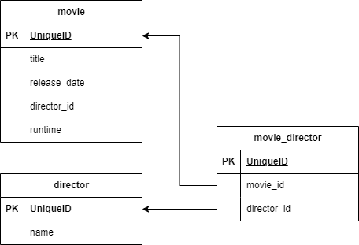

**Viktigt**

Repot är uppdelat från "starten" och sedan fortsättningen. Fortsättningen bor i branchen [cats-and-cat](https://github.com/jensadev/te21-cats/tree/cats-and-cat)

# Recept för ett nytt projekt

* ny mapp `mkdir nytt-projekt`
* gå in i mappen `cd nytt-projekt`
* initiera npm `npm init -y`
* installera paketen du behöver, troligast `npm i express nunjucks`
* behöver du databas installera också `npm i mysql2 dotenv`
* installera även dev dependencies `npm i -D nodemon`
* skapa en .gitignore fil `touch .gitignore`
* lägg till node_modules och .env i .gitignore
* skapa en server.js fil `touch server.js`
* skapa en .env fil `touch .env`
* initiera git `git init`
* Öppna projektet i VS Code `code .`

## Express behöver lite mappar

* skapa en mapp för statiska filer `mkdir public`
* skapa en mapp för templates `mkdir views`
* skapa en mapp för routes `mkdir routes`

## Databas

Kopia db.js från tidigare projekt, den innehåller.

```js
const mysql = require('mysql2')

const pool = mysql.createPool({
  connectionLimit: 10,
  waitForConnections: true,
  queueLimit: 0,
  charset: 'utf8mb4',
  host: process.env.DATABASE_HOST,
  user: process.env.DATABASE_USERNAME,
  password: process.env.DATABASE_PASSWORD,
  database: process.env.DATABASE_DATABASE,
})

module.exports = pool
```

## Server.js

```js
require('dotenv').config()
const express = require('express')
const nunjucks = require('nunjucks')
const bodyParser = require('body-parser')

const indexRouter = require('./routes/index')

const port = process.env.PORT || 3000

const app = express()

nunjucks.configure('views', {
  autoescape: true,
  express: app,
})

app.use(bodyParser.urlencoded({ extended: false }))
app.use(bodyParser.json())
app.use(express.static('public'))

app.use((req, res, next) => {
  res.locals.url = req.originalUrl
  next()
})

app.use('/', indexRouter)

app.listen(port, () => {
  console.log(`Server running on http://localhost:${port}`)
})
```

## Startscript i package.json

```json
  "scripts": {
    "dev": "nodemon -e js,html,njk,json ./server.js"
  },
```

**Rör aldrig `package-lock.json`, den sköter npm själv**

## Skapa ytterligare filer

Du behöver innehållet i dessa filer.

* public/style.css
* views/layout.njk
* views/index.njk
* routes/index.js

### public/style.css

```css
body {
  font-family: sans-serif;
 }
```

### views/layout.njk

```html
html:5 osv...
<body>
  
</body>
```

### views/index.njk

```html



  <h1>{{ title }}</h1>

```

### routes/index.js

```js
const express = require('express')
const router = express.Router()

router.get('/', function (req, res) {
  res.render('index.njk', { title: 'Welcome' })
})

module.exports = router
```

## Hur ser min databas ut då?

Och hur redovisar jag att jag kan planera och skapa en databas?
Skapa tabellerna i draw.io du kan sedan exportera som png och lägga i public mappen. Välj innehållet och checka i selection only när du exporterar. **fil>export as>png**


Jag har här skapat en-till-många relation mellan katt och kattras. Det vill säga att en katt kan bara ha en ras, men en ras kan ha flera katter.

#### Många-till-många

Om du har skapat en relation som är många-till-många så behöver du en pivot tabell. Det vill säga en tabell som håller koll på vilka id:n som hör ihop.



### Skapa tabellerna i TablePlus

Kom ihåg att döpa tabellerna till **<förnamn>_<tabellnamn>**

## Routes

Nu kan vi göra lite routes planering för projektet.

### GET

| Route | Beskrivning |
| --- | --- |
| / | Startsida |
| /cats | Lista alla katter i systemet |
| /cats/:id | Hämta info om en specifik katt |
| /races | Hämta lista på alla kattraser |
| /races/:id | Hämta info om en specifik kattras |

### POST

To be continued...

## Frontend

* Sidan kommer att ha en meny med länkar till alla routes.
* Startsidan ska ha en hero med en bild och en rubrik.
* Skapa en navbar komponent och ladda in i layout.njk
* Skapa en hero komponent och ladda in i index.njk

## SQL

Välj all data från tabellen jens_cat och joina breed. 

```sql
SELECT * FROM jens_cat JOIN jens_cat_breed ON jens_cat.breed_id = jens_cat_breed.id;
```

För att få en bättre query kan vi bestämma vilka kolumner vi vill ha.

```sql
SELECT jens_cat.*. jens_cat_breed.name AS breed FROM jens_cat JOIN jens_cat_breed ON jens_cat.breed_id = jens_cat_breed.id;
```

Om vi har en kopplingstabell som heter jens_movie_director och vi vill ha all data från movie och director.

```sql
SELECT * FROM jens_movie_director
JOIN jens_movie ON jens_movie_director.movie_id = jens_movie.id
JOIN jens_director ON jens_movie_director.director_id = jens_director.id;
```

Denna query kan även den förbättras genom att välja ut vilka kolumner vi vill ha.

```sql
SELECT jens_movie.title, jens_director.name FROM jens_movie_director
JOIN jens_movie ON jens_movie_director.movie_id = jens_movie.id
JOIN jens_director ON jens_movie_director.director_id = jens_director.id;
```

# Arbetsordning med databas

1. Skapa databasen
2. Skapa tabellerna
3. Fyll tabellerna med data (det räcker med 1 rad per tabell)
4. Skapa en query för att hämta all data från tabellerna
  - `SELECT * FROM <tabell>` Kör queryn i TablePlus
5. Förbered ditt projekt för att kunna använda databasen
  - Skapa en server.js fil
  - Skapa en .gitignore fil (.env node_modules/)
  - Skapa en .env fil
  - Skapa en db.js fil (kopiera från förut)
6. Starta server och kolla att det fungerar att surfa till /
7. Skapa en route för att hämta all data från tabellen, /dbtest
  - Börja med att returnera json, `res.json({ message: 'Hello' })`
  - Kolla att det fungerar att surfa till /dbtest
8. Ladda in db.js i routen, `const pool = require('../db')`
9. I din route, skapa en query för att hämta all data från tabellen
  - Detta är en promise så du behöver använda async/await. 
  - `pool.promise().query('SELECT * FROM <tabell>')`
  - Din data behöver sparas i en variabel, den kan heta result eller vad din data faktiskt innehåller. Spara den i square brackets, `const [data]`.
  - Skicka tillbaka datan med `res.json({data})`
10. Kolla att det fungerar att surfa till /dbtest och att du får tillbaka datan.
11. Skapa en vy för att visa datan
  - I din views mapp, skapa en njk fil för att visa datan (kopiera index.njk)
  - Skicka datan till vyn, `res.render('dbtest.njk', { data })`
  - Kom ihåg att du inte kan ha både res.json och res.render i samma route.
12. Kolla att det fungerar att surfa till /dbtest och att du får tillbaka datan i din template.

Gå vidare och repetera stegen som behövs för att göra en join query.
